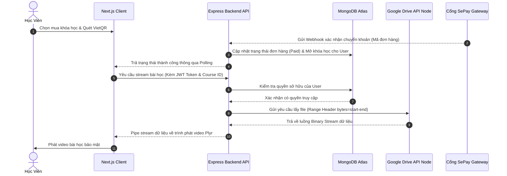

<div align="center">

# 🎓 EduStream LMS
### Nền Tảng Học Trực Tuyến Tối Ưu Hóa Chi Phí & Bảo Mật Video Với Google Drive API

[](https://nextjs.org/)
[](https://nodejs.org/)
[](https://www.mongodb.com/)
[](https://www.google.com/drive/)
[](https://choosealicense.com/)

<p align="center">
  Một giải pháp tối ưu hóa chi phí vận hành lưu trữ video, bảo mật nội dung chống tải trái phép, kết hợp thanh toán tự động thời gian thực (realtime) dành cho các cá nhân kinh doanh khóa học trực tuyến.
</p>

[🌐 Trải Nghiệm Demo Trực Tuyến](#-trải-nghiệm-demo-trực-tuyến) • [🏗️ Thiết Kế Kiến Trúc](#-thiết-kế-kiến-trúc-hệ-thống) • [⚙️ Hướng Dẫn Cài Đặt](#-hướng-dẫn-cài-đặt-local) • [📂 Các Snippet Code Tiêu Biểu](#-mã-nguồn-tiêu-biểu-code-snippets)

</div>

---

## 📸 Hình ảnh & Video thực tế (Demo UI/UX)

*Để có cái nhìn tổng quan nhất về hệ thống hoạt động thực tế, bạn có thể xem các ảnh chụp màn hình và luồng chức năng bên dưới:*

| 🏠 Trang Chủ Đột Phá | 🛒 Giỏ Hàng & Sidebar Bài Giảng |
|:---:|:---:|
|  |  |
| *Giao diện tối giản, hiển thị nguyên gốc giá khóa học.* | *Giỏ hàng Client-side & Sidebar bài học Accordion.* |

| 💳 Luồng Thanh Toán Tự Động VietQR | 🤖 Trò chuyện cùng AI Tutor |
|:---:|:---:|
|  |  |
| *Sinh mã QR động SePay và hỗ trợ nút bypass demo.* | *Chatbot AI tương tác trực tiếp giải đáp bài học.* |

> [!TIP]
> **Video Walkthrough (Loom):** [👉 Click vào đây để xem video vận hành hệ thống thực tế (3 phút)]()

---

## ✨ Điểm nhấn kỹ thuật & Tính năng nổi bật

### 🔒 1. Truyền phát video bảo mật từ Google Drive (Secure Streaming Proxy)
* **Ngăn chặn lấy cắp tài nguyên:** Hệ thống hoàn toàn giấu các đường link trực tiếp của Google Drive. Backend đóng vai trò như một proxy trung gian, xác thực JWT của user, đọc stream nhị phân từ API Drive và truyền tiếp (pipe) về Client.
* **Hỗ trợ Range Request (HTTP 206):** Giúp tua video mượt mà trên mọi thiết bị di động và máy tính, chỉ tải phần video đang xem nhằm tiết kiệm băng thông tối đa.
* **Luân chuyển Node (Load Balancing):** Tự động luân chuyển token API giữa các tài khoản Google Drive khác nhau khi một tài khoản chạm giới hạn quota đọc hàng ngày của Google.

### ⚡ 2. Thanh toán tự động (VietQR & Realtime Webhooks)
* **Kích hoạt sau 3 giây:** Tích hợp API của **SePay** để lắng nghe biến động tài khoản ngân hàng. Khi học viên quét mã QR chuyển khoản đúng nội dung đơn hàng, webhook sẽ phát tín hiệu kích hoạt tức thì.
* **Đồng bộ hóa User Profile thời gian thực:** Đồng bộ tức thì quyền sở hữu khóa học mới vào LocalStorage và State của học viên, người dùng lập tức có thể vào học ngay mà không cần reload trang.

### 📁 3. Trình đồng bộ hóa bài giảng một click (Drive Sync Engine)
* Admin chỉ cần khai báo ID của thư mục gốc của khóa học trên Google Drive.
* Backend tự động phân tích cây thư mục đệ quy, phân loại và chuẩn hóa tên chương học/bài học và đồng bộ trực tiếp vào MongoDB Atlas.

### 🛒 4. Giỏ hàng Client-Side tối ưu
* Sử dụng **React Context** kết hợp **LocalStorage** giúp lưu trữ giỏ hàng bền bỉ, hỗ trợ thêm nhanh nhiều khóa học vào giỏ hàng và thanh toán gộp chỉ bằng 1 giao dịch quét mã.

---

## 🏗️ Thiết kế kiến trúc hệ thống



---

## 🛠️ Công nghệ sử dụng (Technology Stack)

### Frontend (Client-side)
* **Framework:** Next.js 14 (App Router)
* **Styling:** Tailwind CSS, CSS Variables
* **Icons:** Lucide React
* **Player:** Plyr React (Custom UI/UX)

### Backend (Server-side)
* **Runtime:** Node.js, Express Framework
* **Database:** MongoDB Atlas & Mongoose ODM
* **Security:** Helmet CSP, Express Rate Limit, JWT Authentication
* **APIs:** Google APIs Client library v3, SePay Webhook integration

---

## ⚙️ Hướng dẫn cài đặt local (Local Development Setup)

### 1. Cấu hình Backend
Tạo file `/backend/.env` với các tham số sau:
```env
PORT=5002
MONGO_URI=mongodb+srv://<username>:<password>@cluster.mongodb.net/edustream
JWT_SECRET=your_jwt_super_secret_key
SEPAY_WEBHOOK_APIKEY=sepay_api_key_cua_ban
BANK_NAME=your_bank_name
BANK_ACCOUNT_NUMBER=your_bank_account
BANK_ACCOUNT_NAME=your_account_name

# JSON chuỗi của các Google Drive Node
GOOGLE_NODES=[{"id":"node_01","client_id":"...","client_secret":"...","refresh_token":"..."}]
```
Cài đặt dependencies và chạy backend:
```bash
cd backend
npm install
npm run dev
```

### 2. Cấu hình Frontend
Tạo file `/frontend/.env.local`:
```env
NEXT_PUBLIC_API_URL=http://localhost:5002
```
Cài đặt dependencies và chạy frontend:
```bash
cd ../frontend
npm install
npm run dev
```
Truy cập ứng dụng tại địa chỉ: `http://localhost:3000` (hoặc `http://localhost:3001` nếu port 3000 bị chiếm dụng).

---

## 📂 Mã nguồn tiêu biểu (Code Snippets)

Mã nguồn được cấu trúc sạch sẽ và tối ưu hóa hiệu năng, tham khảo các file tiêu biểu trong thư mục `/snippets`:
1. **[Backend Video Stream Controller](snippets/streamController.js):** Xử lý Range Request để tua video và pipe dữ liệu binary từ Drive API về Express.
2. **[Backend Payment Controller](snippets/paymentController.js):** Tiếp nhận webhook biến động số dư và xử lý logic kích hoạt khóa học tự động.
3. **[Frontend Cart Context](snippets/CartContext.jsx):** Đồng bộ hóa giỏ hàng và quản lý trạng thái client-side.
4. **[Frontend Auth Context](snippets/AuthContext.jsx):** Cơ chế làm mới trạng thái sở hữu của học viên trên ứng dụng khi giao dịch hoàn tất.
