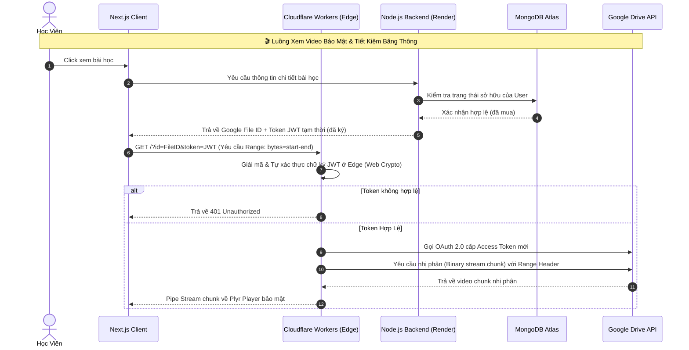

<div align="center">


<br/>

[](https://nextjs.org/)
[](https://workers.cloudflare.com/)
[](https://nodejs.org/)
[](https://expressjs.com/)
[](https://www.mongodb.com/atlas)
[](https://developers.google.com/drive)
[](https://tailwindcss.com/)
[](.)

<br/>

> **Một giải pháp LMS thế hệ mới** tối ưu hóa chi phí lưu trữ video bằng Google Drive API kết hợp kiến trúc **Serverless Proxy với Cloudflare Workers**, bảo mật nội dung khóa học chống tải lậu, kết hợp hệ thống thanh toán tự động thời gian thực (Realtime Webhook) dành cho cá nhân kinh doanh khóa học trực tuyến.

<br/>

[🌐 Live Demo](#-live-demo--tài-khoản-thử-nghiệm) &nbsp;•&nbsp; [✨ Tính năng](#-tính-năng-nổi-bật) &nbsp;•&nbsp; [🏗️ Kiến trúc](#-kiến-trúc-hệ-thống) &nbsp;•&nbsp; [🛠️ Tech Stack](#-technology-stack) &nbsp;•&nbsp; [📂 Code Snippets](#-code-snippets-tiêu-biểu)

</div>

---

> [!IMPORTANT]
> **🔒 Tại sao dự án này giữ mã nguồn ở chế độ Private?**
>
> Đây là **Showcase Repository** — nơi trưng bày tài liệu kiến trúc và các đoạn code tiêu biểu nhất của dự án. Toàn bộ mã nguồn cốt lõi được đặt ở **Private** vì 4 lý do chính:
>
> | | Lý do | Chi tiết |
> |:---:|:---|:---|
> | 💰 | **Đang tạo ra doanh thu thương mại** | Nền tảng đang hoạt động thực tế có thu phí học viên. Công khai code sẽ gây thiệt hại trực tiếp đến tính độc quyền của sản phẩm. |
> | ⚡ | **Bảo vệ giải pháp Serverless Edge** | Giải pháp tích hợp Cloudflare Workers tối ưu hóa băng thông truyền phát video từ Drive là giải pháp tự thiết kế giúp vận hành hệ thống với chi phí $0. |
> | 🏦 | **Bảo mật tích hợp thanh toán** | Cấu trúc xử lý Webhook ngân hàng SePay, chiến lược kiểm tra chữ ký API Key và logic đối soát số tiền giao dịch là thông tin nhạy cảm. |
> | 👀 | **Hỗ trợ nhà tuyển dụng đánh giá** | Các đoạn code sạch đặc trưng nhất đã được trích xuất và lưu trong thư mục [`/snippets`](./snippets) để minh chứng tư duy thiết kế và kỹ năng lập trình. |

---

## 🌐 Live Demo & Tài khoản thử nghiệm

> [!TIP]
> Trải nghiệm đầy đủ hệ thống mà không cần cài đặt. Nhấn nút Demo, đăng nhập và bắt đầu khám phá ngay!

<div align="center">

| | Thông tin |
|:---|:---|
| 🌍 **Live URL** | [https://edu-stream.vercel.app](https://edu-stream.vercel.app) *(cập nhật link thực tế của bạn)* |
| 🎬 **Video Demo (Loom)** | [👉 Xem video 3 phút demo toàn bộ hệ thống hoạt động thực tế](#) |
| 👤 **Tài khoản Học Viên** | `student@gmail.com` / `student123` |
| 🔑 **Tài khoản Admin** | `admin@lms.com` / `admin123` |

</div>

---

## 📸 Giao diện thực tế (UI Screenshots)

> *Toàn bộ giao diện được thiết kế đồng nhất Dark/Light Mode, hỗ trợ responsive trên mọi thiết bị.*

### 🏠 Trang chủ & Thư viện khóa học

| Trang Chủ | Thư Viện Khoá Học |
|:---:|:---:|
|  |  |
| *Hero section, Danh sách khoá học nổi bật.* | *Lọc theo chủ đề, tìm kiếm và phân trang.* |

### 🎬 Trải nghiệm học tập & Thanh toán

| Trình Phát Video Bài Học | Luồng Thanh Toán VietQR |
|:---:|:---:|
|  |  |
| *Plyr Player + Sidebar bài giảng Accordion.* | *Sinh mã QR tự động và kích hoạt sau 3 giây.* |

### 🛒 Giỏ hàng & Dashboard Admin

| Giỏ Hàng Client-Side | Bảng Điều Khiển Admin |
|:---:|:---:|
|  |  |
| *Thêm nhiều khoá học, thanh toán một lần.* | *Quản lý khoá học, đồng bộ Drive, xem đơn hàng.* |

---

## ✨ Tính năng nổi bật

<table>
<tr>
<td width="50%">

### 🔒 Serverless Video Proxy (CF Workers)
Hệ thống **giấu hoàn toàn URL Drive**. Backend chính chỉ xác thực quyền của học viên, sau đó client gọi trực tiếp đến **Cloudflare Worker** ở mạng biên. Worker xác thực chữ ký JWT, nạp video theo từng chunk bảo mật trực tiếp từ Google API.

- ✅ Giải phóng 100% băng thông cho server chính
- ✅ Phục vụ không giới hạn người xem đồng thời
- ✅ Chống download, chống inspect element
- ✅ Tự động fallback về server Node.js khi cần

</td>
<td width="50%">

### ⚡ Realtime Auto Payment
Tích hợp cổng **SePay Webhook** — ngay khi học viên quét QR và chuyển khoản đúng nội dung, backend nhận tín hiệu, đối soát và **kích hoạt khóa học trong vòng 3 giây**.

- ✅ Sinh mã QR VietQR động theo từng đơn hàng
- ✅ Đối soát số tiền sai lệch tự động (tránh lỗi làm tròn)
- ✅ Đồng bộ ngay vào tài khoản không cần admin duyệt

</td>
</tr>
<tr>
<td width="50%">

### 📁 Drive Sync Engine
Admin chỉ cần **dán ID thư mục Google Drive** — hệ thống tự động quét đệ quy cây thư mục con, chuẩn hóa tên chương/bài học, tách loại video/tài liệu và đồng bộ vào MongoDB.

- ✅ Quét đệ quy cấu trúc thư mục con không giới hạn cấp
- ✅ Tự động nhận diện thứ tự bài học (Natural Sorting)
- ✅ Một click sync toàn bộ khóa học

</td>
<td width="50%">

### 🛒 Smart Shopping Cart & Security
Quản lý giỏ hàng bằng **React Context + LocalStorage**. Bảo mật hệ thống chống tấn công dò mật khẩu và bảo vệ API đăng nhập/đăng ký bằng Rate Limiter chuyên biệt.

- ✅ Giỏ hàng bền bỉ, cập nhật realtime
- ✅ Thanh toán gộp nhiều khóa học cùng lúc
- ✅ Chống Brute Force bằng Rate Limit tối ưu (không ảnh hưởng trang cá nhân)

</td>
</tr>
</table>

---

## 🏗️ Kiến trúc hệ thống

Kiến trúc **Serverless Stream Proxy** sử dụng Cloudflare Workers ở biên giúp hệ thống vận hành với chi phí $0 nhưng chịu tải cực cao:



---

## 🛠️ Technology Stack

<div align="center">

| Layer | Công nghệ | Lý do chọn |
|:---:|:---:|:---|
| **Frontend** |  | App Router, SSR/CSR hybrid, tối ưu SEO vượt trội |
| **Edge Network** |  | Serverless proxy, xử lý stream trực tiếp ở biên, chi phí $0 |
| **Styling** |  | Utility-first, dark mode, tối ưu hiệu năng CSS |
| **Video Player** |  | Trình phát nhẹ, hỗ trợ đầy đủ Range request & phụ đề |
| **Backend** |   | Kiến trúc REST API hiệu năng cao, điều phối luồng linh hoạt |
| **Database** |  | Cơ sở dữ liệu tài liệu linh hoạt, dễ dàng lưu trữ cấu trúc cây bài giảng |
| **Auth** |  | JWT mã hóa RSA/HMAC bảo mật tuyệt đối các đường dẫn stream |
| **Video Source** |  | Lưu trữ dung lượng cực lớn miễn phí, phân phối qua mạng nội bộ Google |
| **Payment** |  | Cổng Webhook biến động số dư nhanh chóng, hoạt động 24/7 |

</div>

---

## 📂 Code Snippets tiêu biểu

*Các đoạn mã dưới đây được trích xuất, làm sạch thông tin nhạy cảm và trình bày để thể hiện tư duy thiết kế hệ thống:*

<details>
<summary>⚡ <strong>Cloudflare Worker: Secure Edge Stream Proxy</strong> — <code>snippets/cloudflareWorker.js</code></summary>

👉 [Xem đầy đủ tại snippets/cloudflareWorker.js](./snippets/cloudflareWorker.js)
</details>

<details>
<summary>🎬 <strong>Backend: Fallback Video Streaming Proxy</strong> — <code>snippets/streamController.js</code></summary>

👉 [Xem đầy đủ tại snippets/streamController.js](./snippets/streamController.js)
</details>

<details>
<summary>💳 <strong>Backend: SePay Realtime Webhook Handler</strong> — <code>snippets/paymentController.js</code></summary>

👉 [Xem đầy đủ tại snippets/paymentController.js](./snippets/paymentController.js)
</details>

<details>
<summary>🛒 <strong>Frontend: Cart Context với LocalStorage Sync</strong> — <code>snippets/CartContext.jsx</code></summary>

👉 [Xem đầy đủ tại snippets/CartContext.jsx](./snippets/CartContext.jsx)
</details>

---

## 📊 Metrics & Kết quả thực tế

<div align="center">

| 📈 Chỉ số | 🎯 Kết quả |
|:---|:---:|
| Thời gian tự động kích hoạt khóa học sau thanh toán | **< 3 giây** |
| Số lượng người xem video 2 tiếng đồng thời | **Không giới hạn** *(nhờ Cloudflare Edge)* |
| Băng thông tiêu hao trên Server Backend chính | **0%** *(phục vụ stream qua Worker)* |
| Chi phí lưu trữ video hàng tháng | **$0** *(Sử dụng các Google Drive API Nodes)* |
| Thời gian admin cần để đồng bộ toàn bộ khóa học mới | **1 click** *(Quét đệ quy tự động)* |

</div>

---

## ⚙️ Cài đặt local (Development Setup)

<details>
<summary>📋 Xem hướng dẫn cài đặt đầy đủ</summary>

### 1️⃣ Backend
```bash
cd backend
npm install
```
Tạo file `.env`:
```env
PORT=5002
MONGO_URI=mongodb+srv://<user>:<pass>@cluster.mongodb.net/edustream
JWT_SECRET="your_super_secret" # Lưu ý bọc nháy kép nếu chứa ký tự đặc biệt như #
SEPAY_WEBHOOK_APIKEY=your_sepay_key
BANK_NAME=MBBank
BANK_ACCOUNT_NUMBER=0123456789
GOOGLE_NODES=[{"id":"node_01","client_id":"...","client_secret":"...","refresh_token":"..."}]
```
```bash
npm run dev  # http://localhost:5002
```

### 2️⃣ Cloudflare Worker
Tạo Worker trên Cloudflare Dashboard và thiết lập các biến môi trường:
* `JWT_SECRET` (khớp với backend)
* `GOOGLE_NODES` (khớp với backend)

### 3️⃣ Frontend
```bash
cd frontend
npm install
```
Tạo file `.env.local`:
```env
NEXT_PUBLIC_API_URL=http://localhost:5002
NEXT_PUBLIC_CF_WORKER_URL=https://<your-worker-subdomain>.workers.dev/
```
```bash
npm run dev  # http://localhost:3000
```

</details>

---

<div align="center">

### 📬 Liên hệ

[](https://github.com/vanphu1201)
[](https://github.com/vanphu1201)

*Nếu bạn là nhà tuyển dụng muốn xem thêm chi tiết hoặc cần tài khoản demo đặc biệt, vui lòng liên hệ qua GitHub.*


</div>
