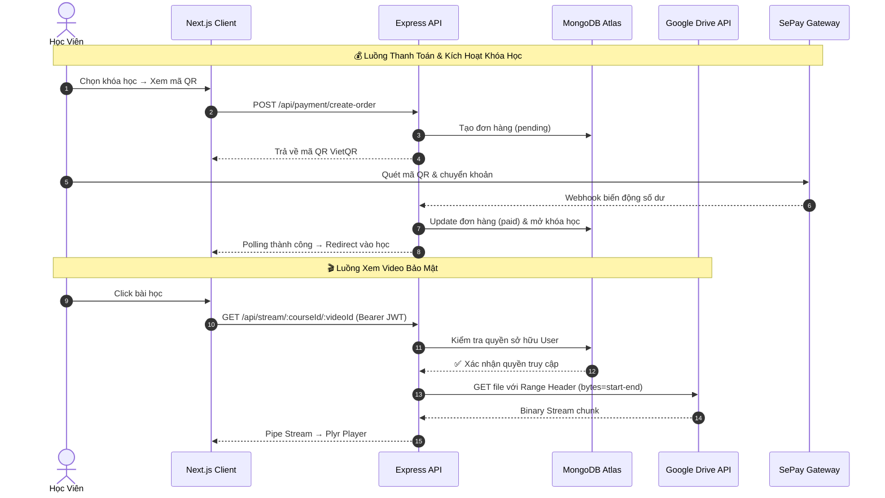

<div align="center">


<br/>

[](https://nextjs.org/)
[](https://nodejs.org/)
[](https://expressjs.com/)
[](https://www.mongodb.com/atlas)
[](https://developers.google.com/drive)
[](https://tailwindcss.com/)
[](https://jwt.io/)
[](.)

<br/>

> **Một giải pháp LMS thế hệ mới** tối ưu hóa chi phí lưu trữ video bằng Google Drive API, bảo mật nội dung khóa học chống tải lậu, kết hợp hệ thống thanh toán tự động thời gian thực (Realtime Webhook) dành cho cá nhân kinh doanh khóa học trực tuyến.

<br/>

[🌐 Live Demo](#-live-demo--tài-khoản-thử-nghiệm) &nbsp;•&nbsp; [✨ Tính năng](#-tính-năng-nổi-bật) &nbsp;•&nbsp; [🏗️ Kiến trúc](#-kiến-trúc-hệ-thống) &nbsp;•&nbsp; [🛠️ Tech Stack](#-technology-stack) &nbsp;•&nbsp; [📂 Code Snippets](#-code-snippets-tiêu-biểu)

</div>

---

> [!IMPORTANT]
> **🔒 Tại sao dự án này giữ mã nguồn ở chế độ Private?**
>
> Đây là **Showcase Repository** — nơi trưng bày tài liệu kiến trúc và các đoạn code tiêu biểu nhất của dự án. Toàn bộ mã nguồn cốt lõi được đặt ở **Private** vì 4 lý do chính:
>
> | | Lý do | Chi tiết |
> |:---:|:---|:---|
> | 💰 | **Đang tạo ra doanh thu thương mại** | Nền tảng đang hoạt động thực tế có thu phí học viên. Công khai code sẽ gây thiệt hại trực tiếp đến tính độc quyền của sản phẩm. |
> | 🔐 | **Bảo vệ thuật toán chống tải lậu** | Giải pháp ẩn hoàn toàn URL Drive và kỹ thuật Proxy Stream là giải pháp tự phát triển — cần bảo vệ bản quyền kỹ thuật. |
> | 🏦 | **Bảo mật tích hợp thanh toán** | Cấu trúc xử lý Webhook ngân hàng SePay, chiến lược kiểm tra chữ ký API Key và logic đối soát số tiền giao dịch là thông tin nhạy cảm. |
> | 👀 | **Hỗ trợ nhà tuyển dụng đánh giá** | Các đoạn code sạch đặc trưng nhất đã được trích xuất và lưu trong thư mục [`/snippets`](./snippets) để minh chứng tư duy thiết kế và kỹ năng lập trình. |

---

## 🌐 Live Demo & Tài khoản thử nghiệm

> [!TIP]
> Trải nghiệm đầy đủ hệ thống mà không cần cài đặt. Nhấn nút Demo, đăng nhập và bắt đầu khám phá ngay!

<div align="center">

| | Thông tin |
|:---|:---|
| 🌍 **Live URL** | [https://edu-stream.vercel.app](https://edu-stream.vercel.app) *(cập nhật link thực tế của bạn)* |
| 🎬 **Video Demo (Loom)** | [👉 Xem video 3 phút demo toàn bộ hệ thống hoạt động thực tế](#) |
| 👤 **Tài khoản Học Viên** | `recruiter@edustream.test` / `demo123456` |
| 🔑 **Tài khoản Admin** | `admin@edustream.test` / `admin123456` |

</div>

---

## 📸 Giao diện thực tế (UI Screenshots)

> *Toàn bộ giao diện được thiết kế đồng nhất Dark/Light Mode, hỗ trợ responsive trên mọi thiết bị.*

### 🏠 Trang chủ & Thư viện khóa học

| Trang Chủ | Thư Viện Khoá Học |
|:---:|:---:|
|  |  |
| *Hero section, Danh sách khoá học nổi bật.* | *Lọc theo chủ đề, tìm kiếm và phân trang.* |

### 🎬 Trải nghiệm học tập & Thanh toán

| Trình Phát Video Bài Học | Luồng Thanh Toán VietQR |
|:---:|:---:|
|  |  |
| *Plyr Player + Sidebar bài giảng Accordion.* | *Sinh mã QR tự động và kích hoạt sau 3 giây.* |

### 🛒 Giỏ hàng & Dashboard Admin

| Giỏ Hàng Client-Side | Bảng Điều Khiển Admin |
|:---:|:---:|
|  |  |
| *Thêm nhiều khoá học, thanh toán một lần.* | *Quản lý khoá học, đồng bộ Drive, xem đơn hàng.* |

---

## ✨ Tính năng nổi bật

<table>
<tr>
<td width="50%">

### 🔒 Secure Video Streaming
Hệ thống **giấu hoàn toàn URL Drive**, backend hoạt động như một proxy trung gian — xác thực JWT, đọc stream nhị phân từ Google Drive API và truyền về client theo từng chunk bảo mật.

- ✅ Chống download, chống inspect element
- ✅ HTTP Range Request (tua video mượt mà)
- ✅ Multi-node load balancing (tự chuyển node khi hết quota)

</td>
<td width="50%">

### ⚡ Realtime Auto Payment
Tích hợp cổng **SePay Webhook** — ngay khi học viên quét QR và chuyển khoản đúng nội dung, backend nhận tín hiệu, đối soát và **kích hoạt khóa học trong vòng 3 giây**.

- ✅ Sinh mã QR VietQR động theo từng đơn hàng
- ✅ Webhook API Key authentication
- ✅ Đồng bộ ngay vào tài khoản không cần admin duyệt

</td>
</tr>
<tr>
<td width="50%">

### 📁 Drive Sync Engine
Admin chỉ cần **dán ID thư mục Google Drive** — hệ thống tự động quét đệ quy cây thư mục, chuẩn hóa tên chương/bài học và đồng bộ toàn bộ vào MongoDB.

- ✅ Quét đệ quy cấu trúc thư mục
- ✅ Tự động phân tích thứ tự bài học
- ✅ Một click sync toàn bộ khóa học

</td>
<td width="50%">

### 🛒 Smart Shopping Cart
Quản lý giỏ hàng bằng **React Context + LocalStorage** — hỗ trợ thêm nhanh nhiều khóa học, thanh toán gộp bằng 1 giao dịch và đồng bộ trạng thái realtime lên Navbar.

- ✅ Giỏ hàng bền bỉ sau khi refresh trang
- ✅ Huy hiệu số lượng động trên Navbar
- ✅ Thanh toán gộp nhiều khóa học cùng lúc

</td>
</tr>
</table>

---

## 🏗️ Kiến trúc hệ thống



---

## 🛠️ Technology Stack

<div align="center">

| Layer | Công nghệ | Lý do chọn |
|:---:|:---:|:---|
| **Frontend** |  | App Router, SSR/CSR hybrid, tối ưu SEO |
| **Styling** |  | Utility-first, dark mode, responsive cực nhanh |
| **Video Player** |  | Lightweight, custom UI, hỗ trợ Range stream |
| **Backend** |   | REST API nhanh, xử lý stream hiệu năng cao |
| **Database** |  | Flexible schema, cloud-native, dễ scale |
| **Auth** |  | Stateless, bảo mật stream endpoint |
| **Video Source** |  | Chi phí $0, dung lượng 15GB/tài khoản miễn phí |
| **Payment** |  | Webhook realtime, hỗ trợ mọi ngân hàng Việt Nam |
| **Security** |  | CSP, CORS policy, Rate limiting |

</div>

---

## 📂 Code Snippets tiêu biểu

*Các đoạn mã dưới đây được trích xuất, làm sạch thông tin nhạy cảm và trình bày để thể hiện tư duy thiết kế hệ thống:*

<details>
<summary>🎬 <strong>Backend: Secure Video Streaming Proxy</strong> — <code>snippets/streamController.js</code></summary>

```js
// Xác thực quyền sở hữu → Gửi Range Request → Pipe stream về client
exports.streamVideo = async (req, res) => {
  const { courseId, videoId } = req.params;

  // 1. Kiểm tra JWT + quyền sở hữu khóa học
  const user = await User.findById(req.user.id);
  const hasAccess = user.purchasedCourses.some(id => id.toString() === courseId);
  if (!hasAccess) return res.status(403).json({ message: "Access Denied" });

  // 2. Lấy Drive Node đang hoạt động (tự chuyển node khi hết quota)
  let driveNode = getActiveDriveNode();
  const drive = google.drive({ version: 'v3', auth: driveNode.auth });

  // 3. Xử lý Range Header để tua video
  const range = req.headers.range;
  if (range) {
    const [start, end] = range.replace(/bytes=/, "").split("-");
    res.writeHead(206, { 'Content-Range': `bytes ${start}-${end}/${fileSize}` });
  }

  // 4. Pipe stream bảo mật từ Drive về client (không lộ URL)
  const driveStream = await drive.files.get(
    { fileId: videoId, alt: 'media' },
    { headers: { Range: range }, responseType: 'stream' }
  );
  driveStream.data.pipe(res);
};
```
👉 [Xem đầy đủ tại snippets/streamController.js](./snippets/streamController.js)
</details>

<details>
<summary>💳 <strong>Backend: SePay Realtime Webhook Handler</strong> — <code>snippets/paymentController.js</code></summary>

```js
// Xác thực webhook → Đối soát đơn hàng → Kích hoạt khóa học tức thì
exports.sepayWebhook = async (req, res) => {
  // 1. Xác thực API Key của SePay
  const apiKey = req.get('apikey');
  if (apiKey !== process.env.SEPAY_WEBHOOK_APIKEY)
    return res.status(401).json({ success: false });

  // 2. Tìm mã đơn hàng trong nội dung chuyển khoản (LMS + 6 ký tự)
  const orderCode = req.body.content.match(/LMS[A-Z0-9]{6}/)?.[0];
  const order = await Order.findOne({ orderCode, status: 'pending' });

  // 3. Đối soát số tiền (sai lệch ±1000đ để tránh lỗi làm tròn)
  if (Math.abs(req.body.transferAmount - order.amount) > 1000)
    return res.status(200).json({ success: true, message: 'Số tiền không khớp' });

  // 4. Cập nhật trạng thái và mở khóa học cho học viên
  order.status = 'paid';
  await order.save();
  await User.findByIdAndUpdate(order.userId, {
    $addToSet: { purchasedCourses: { $each: order.courseIds } }
  });
};
```
👉 [Xem đầy đủ tại snippets/paymentController.js](./snippets/paymentController.js)
</details>

<details>
<summary>🛒 <strong>Frontend: Cart Context với LocalStorage Sync</strong> — <code>snippets/CartContext.jsx</code></summary>

```jsx
export const CartProvider = ({ children }) => {
  const [cart, setCart] = useState([]);

  // Khởi tạo giỏ hàng từ LocalStorage khi app load
  useEffect(() => {
    const saved = localStorage.getItem('es_cart');
    if (saved) setCart(JSON.parse(saved));
  }, []);

  const addToCart = (course) => {
    if (cart.some(item => item._id === course._id)) return false; // Chống trùng
    const newCart = [...cart, course];
    setCart(newCart);
    localStorage.setItem('es_cart', JSON.stringify(newCart));
    window.dispatchEvent(new Event('storage')); // Trigger Navbar badge update
    return true;
  };

  return (
    <CartContext.Provider value={{ cart, addToCart, removeFromCart, clearCart, isInCart }}>
      {children}
    </CartContext.Provider>
  );
};
```
👉 [Xem đầy đủ tại snippets/CartContext.jsx](./snippets/CartContext.jsx)
</details>

---

## 📊 Metrics & Kết quả thực tế

<div align="center">

| 📈 Chỉ số | 🎯 Kết quả |
|:---|:---:|
| Thời gian kích hoạt khóa học sau thanh toán | **< 3 giây** |
| Tỷ lệ stream video không bị gián đoạn (uptime) | **~99%** *(nhờ multi-node failover)* |
| Chi phí lưu trữ video hàng tháng | **$0** *(Google Drive 15GB/node)* |
| Thời gian admin cần để thêm toàn bộ khoá học mới | **1 click** |
| Tỷ lệ tự động hóa quy trình thanh toán | **100%** *(không cần duyệt thủ công)* |

</div>

---

## ⚙️ Cài đặt local (Development Setup)

<details>
<summary>📋 Xem hướng dẫn cài đặt đầy đủ</summary>

### 1️⃣ Backend
```bash
cd backend
npm install
```
Tạo file `.env`:
```env
PORT=5002
MONGO_URI=mongodb+srv://<user>:<pass>@cluster.mongodb.net/edustream
JWT_SECRET=your_super_secret
SEPAY_WEBHOOK_APIKEY=your_sepay_key
BANK_NAME=MBBank
BANK_ACCOUNT_NUMBER=0123456789
GOOGLE_NODES=[{"id":"node_01","client_id":"...","client_secret":"...","refresh_token":"..."}]
```
```bash
npm run dev  # http://localhost:5002
```

### 2️⃣ Frontend
```bash
cd frontend
npm install
```
Tạo file `.env.local`:
```env
NEXT_PUBLIC_API_URL=http://localhost:5002
```
```bash
npm run dev  # http://localhost:3000
```

</details>

---

<div align="center">

### 📬 Liên hệ

[](https://github.com/vanphu1201)
[](https://github.com/vanphu1201)

*Nếu bạn là nhà tuyển dụng muốn xem thêm chi tiết hoặc cần tài khoản demo đặc biệt, vui lòng liên hệ qua GitHub.*


</div>
