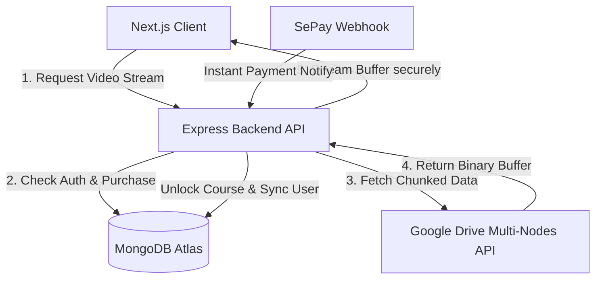

# EduStream LMS - Google Drive Video Streaming & Automated Payment Platform

> **Lưu ý quan trọng (Important Note):** Đây là repository chứa tài liệu thiết kế hệ thống và giới thiệu dự án (Showcase Repo). Mã nguồn cốt lõi (Core Codebase) được giữ ở chế độ Riêng tư (Private) vì mục đích thương mại và bảo mật sản phẩm. Bản giới thiệu này cung cấp thiết kế kiến trúc và một số đoạn mã nguồn tiêu biểu thể hiện tư duy kỹ thuật của dự án.

---

## 📌 Giới thiệu dự án
**EduStream LMS** là nền tảng quản lý học tập trực tuyến (LMS) tối ưu hóa chi phí vận hành bằng cách sử dụng **Google Drive** làm máy chủ lưu trữ và truyền phát (streaming) video bảo mật cao. Nền tảng được tích hợp tính năng đồng bộ hóa bài giảng tự động, AI trợ lý học tập trực tiếp, và quy trình thanh toán kích hoạt tức thì.

* **Bản chạy thử (Live Demo):** [Link demo dự án] *(Ví dụ: https://edustream.io)*
* **Tài khoản Recruiter Test:** `recruiter@edustream.test` / Mật khẩu: `123456`
* **Video giới thiệu (Loom Walkthrough):** [Link video giới thiệu hoạt động thực tế]

---

## 🚀 Tính năng cốt lõi

### 1. Truyền Phát Video Bảo Mật Từ Google Drive (Secure Streaming)
* **Chống Tải Chùa (Anti-downloading):** Hệ thống không trả về đường dẫn (URL) trực tiếp của Google Drive cho client. Thay vào đó, backend đóng vai trò là một proxy streaming, chia nhỏ video thành các chunks dữ liệu và gửi dưới dạng binary stream kèm theo token bảo mật xác thực phiên làm việc.
* **Cơ chế dự phòng (Drive Node Load Balancing):** Hỗ trợ cấu hình multi-node Google Drive API. Khi một node vượt quá giới hạn băng thông (quota API), backend sẽ tự động luân chuyển sang node tiếp theo để đảm bảo luồng xem không bị gián đoạn.

### 2. Tự Động Hóa Đồng Bộ Bài Giảng (Google Drive Sync Engine)
* **One-Click Sync:** Admin chỉ cần cấu hình ID thư mục khóa học trên Google Drive, hệ thống sẽ tự động quét đệ quy các thư mục con (Chương) và file video/tài liệu (Bài học) để đồng bộ vào MongoDB.
* **Phân tích siêu dữ liệu:** Tự động lọc các ký tự đặc biệt, cấu trúc hóa thứ tự bài giảng theo đúng định dạng được sắp xếp trên Drive.

### 3. Quy Trình Thanh Toán & Kích Hoạt Tự Động (Automation Payment Flow)
* **SePay Webhook Integration:** Tự động sinh mã QR thanh toán nhanh (VietQR) tương ứng với từng mã đơn hàng và số tiền chính xác.
* **Kích hoạt tức thì:** Backend nhận thông báo biến động số dư qua webhook thời gian thực (realtime webhook), phân tích cú pháp đơn hàng và mở khóa khóa học cho học viên trong vòng 3 giây mà không cần admin duyệt thủ công.

### 4. Shopping Cart & Không Gian Học Tập Trực Quan
* **Shopping Cart:** Quản lý giỏ hàng phía Client bằng React Context & LocalStorage, cho phép thêm nhanh nhiều khóa học và tiến hành thanh toán tập trung.
* **Trình phát bài học cao cấp:** Tích hợp trình phát video Plyr tối giản, thanh sidebar bài giảng dạng accordion tự động cuộn độc lập, bộ ghi chú (Notes) đánh dấu mốc thời gian (timestamp) thông minh.
* **AI Tutor Chatbot:** Trợ lý học tập sử dụng Gemini/OpenAI API được nhúng sẵn trên giao diện, hỗ trợ học viên giải đáp kiến thức liên quan tới nội dung khóa học ngay tại chỗ.

---

## 🏗️ Kiến trúc hệ thống (System Architecture)

---

## 🛠️ Công nghệ sử dụng (Technology Stack)

* **Frontend:** Next.js (App Router), React, TailwindCSS, Lucide Icons, Plyr Player.
* **Backend:** Node.js, Express, Mongoose (MongoDB Atlas), Google APIs Client.
* **Security & Optimization:** Helmet (CORS policy control), Express Rate Limit, Gzip Compression, JWT Auth.
* **Third-party integrations:** Google Drive API v3, SePay Gateway, OpenAI/Gemini SDK.

---

## 📂 Mã nguồn tiêu biểu (Code Snippets)
Để xem chi tiết cấu trúc triển khai của các mô-đun quan trọng, vui lòng tham khảo thư mục `/snippets` trong repository này:
1. **[Backend Video Stream Controller](snippets/streamController.js):** Quản lý luồng stream video chunk từ Google Drive API và đóng vai trò proxy bảo mật bảo vệ tài nguyên video.
2. **[Backend Payment Controller](snippets/paymentController.js):** Xử lý quy trình tạo đơn hàng thanh toán qua cổng SePay và tiếp nhận webhook kích hoạt tự động.
3. **[Frontend Cart Context](snippets/CartContext.jsx):** Quản lý trạng thái giỏ hàng đồng bộ liên tục với local storage và giao diện navbar phía học viên.
4. **[Frontend Auth Context](snippets/AuthContext.jsx):** Quản lý phiên đăng nhập và cơ chế tự động đồng bộ hóa thông tin người dùng với máy chủ theo thời gian thực.
